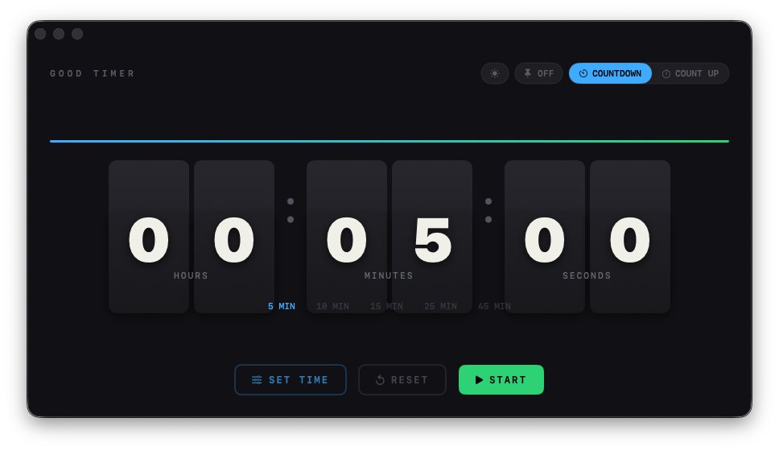

# Good Timer

一款 macOS 計時器應用程式，以復古的火車站翻牌時鐘為設計靈感，提供流暢的倒數與正數計時體驗。



---

## 功能特色

- **翻牌時鐘動畫**：採用雙葉片機制（上半葉片向下翻、下半葉片從下往上翻），忠實重現日本車站電子顯示板的視覺效果
- **倒數計時 / 正數計時**：支援兩種計時模式，切換自如
- **快速預設時間**：提供 5、10、15、25、45 分鐘等常用快選，一鍵設定
- **深色 / 淺色主題**：右上角可一鍵切換，適應不同使用情境
- **進度條顯示**：視覺化呈現計時進度
- **小計時模式**：可收起為精簡視圖，不佔用桌面空間

---

## 系統需求

- macOS 13 Ventura 以上
- Swift 5.9+

---

## 安裝與執行

```bash
git clone https://github.com/YOUR_USERNAME/good-timer.git
cd good-timer
swift run
```

---

## 操作說明

| 操作 | 說明 |
|------|------|
| **SET TIME** | 手動輸入計時時間（時 / 分 / 秒） |
| **START / PAUSE** | 開始或暫停計時 |
| **RESET** | 重設計時器 |
| **快選時間** | 點擊下方分鐘數快速設定 |
| **COUNTDOWN / COUNT UP** | 切換倒數或正數模式 |
| ☀ / 🌙 | 切換深色 / 淺色介面主題 |

---

## 技術架構

- **SwiftUI** — 原生 macOS 介面框架
- **Swift Package Manager** — 套件管理
- **rotation3DEffect** — 翻牌動畫（雙葉片同步）
- **AppTheme** 結構 — 統一管理深色 / 淺色主題色票
